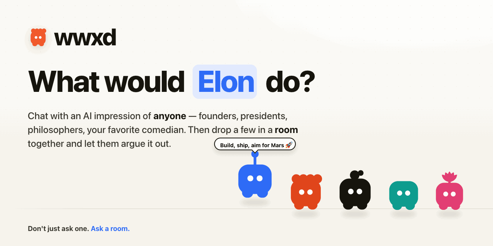
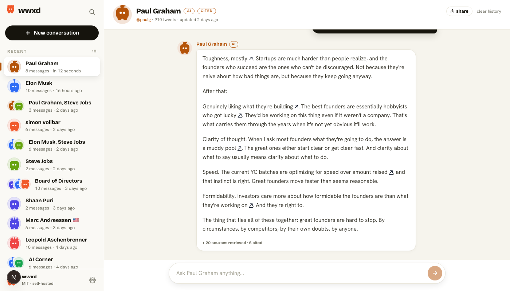
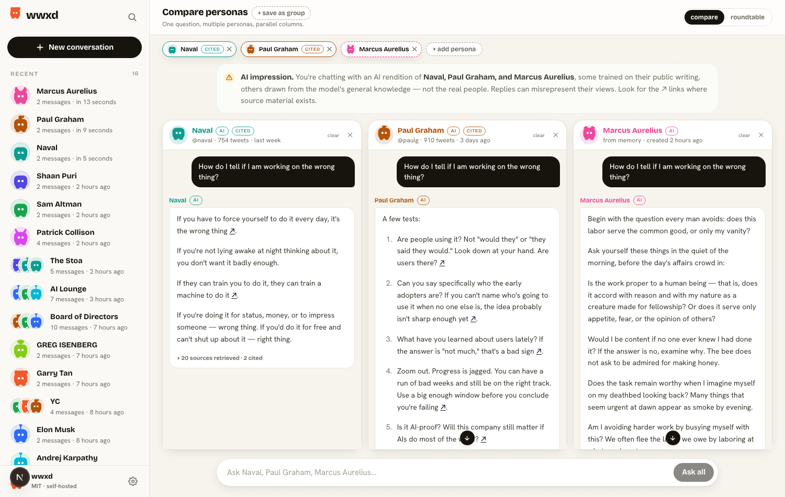

<p align="center">
  
</p>

<p align="center">
  <a href="./LICENSE"></a>
  <a href="https://nextjs.org"></a>
  <a href="https://react.dev"></a>
  <a href="#tests--evals"></a>
  <a href="#contributing"></a>
</p>

<p align="center">
  <a href="#get-going">Get going</a> ·
  <a href="#what-you-get">What you get</a> ·
  <a href="#bring-your-own-model">Providers</a> ·
  <a href="#how-the-roundtable-works">Roundtable</a> ·
  <a href="#what-it-costs">Costs</a> ·
  <a href="#contributing">Contribute</a>
</p>

<p align="center">
  <a href="#caveats-worth-reading" title="More on what wwxd can and can't tell you"></a>
</p>

## Get going

Three commands and you're in.

```bash
git clone https://github.com/juanfiguera/wwxd.git
cd wwxd
cp .env.example .env.local      # add at least one LLM provider key
pnpm install
pnpm dev                         # → http://localhost:3000
```

## What you get

**A room of any minds you want, arguing your question.** Drop Paul Graham, Naval, and Marcus Aurelius into the same conversation and watch them disagree about your next move. The personas speak in turn, react to each other by name, and pass when they have nothing to add — so you get perspectives, not noise. Use it to stress-test your thinking, not to outsource it.

<p align="center">
  
</p>

Solo works too — same surface, one persona, when you just want to ask Steve Jobs about your homepage. Save any lineup as a **Group** ("Board of Directors", "The Stoa") and one-click it from the sidebar.

**Two ways to build a persona, mix freely in the same room:**

- **Grounded** — feed wwxd their writing (tweets via Apify, essays from URLs/RSS/sitemap, YouTube transcripts) and replies link back to specific chunks with `↗`. You're hearing a synthesis of what they actually wrote. Wears a `CITED` pill.
- **Prior-only** — just type a name. Instant. The model generates the persona from its memory. Perfect for historical figures and anyone you can't ingest. Reads "from memory".

### Try these on day one

Rooms to spin up the moment you've got two or three personas in your sidebar:

- **Founders Roundtable** — Paul Graham, Naval, Sam Altman: *"I have a stable job at a big company and a startup idea I can't shake. What am I missing?"*
- **AI Lounge** — Sam Altman, Andrej Karpathy, Demis Hassabis, Andrew Ng: *"Is taste and judgment the most important thing in the age of AI?"*
- **The Stoa** — Marcus Aurelius, Seneca, Naval: *"A colleague took credit for my work in front of the team. What now?"*
- **Design crit** — Steve Jobs, Jony Ive, Dieter Rams: *paste your homepage hero copy and ask "what would you cut?"*
- **Devil's advocate** — anyone you actually agree with, plus their loudest critic: *pitch your idea and let them argue.*

## Make your first persona

After `pnpm dev`, open [http://localhost:3000](http://localhost:3000). The sidebar starts empty with an "Add a persona" card. Two tabs:

- **X handle** — paste a handle. About a minute for the latest 850 tweets. Needs `APIFY_TOKEN` + an embedding provider.
- **Name anyone** — type a name. Instant. No tokens beyond your LLM provider.

Make one, click their card, ask them something. That's the whole loop.

## Three ways to talk to them

| | URL | What it is |
| --- | --- | --- |
| **Solo** | `/<slug>` | One on one. |
| **Compare** | `/compare?personas=a,b,c` | Same prompt, parallel columns. See where they differ. |
| **Roundtable** | `/compare?personas=a,b,c&mode=roundtable` | They take turns and react to each other by name. A gate lets a persona pass when they have nothing to add. |

Compare mode looks like this — same prompt, one column per persona, no cross-talk:

<p align="center">
  
</p>

**Share** a conversation as Markdown, plain text, or a versioned `.wwxd.json` snapshot.

## Bring your own model

Edit `.env.local` and point wwxd at whoever you trust. Anthropic, OpenAI, Ollama running locally, anything OpenAI-compatible (OpenRouter, vLLM, LMStudio).

The file is split in two: an **API KEYS** block at the top, then provider config below. Drop the keys you have, leave the rest blank, and tweak the providers if the defaults don't fit. Common path:

```bash
# 1. Drop your keys
ANTHROPIC_API_KEY=sk-ant-...        # for chat
OPENAI_API_KEY=sk-...               # for embeddings (powers citations)

# 2. Providers (these are the defaults — change if you want)
LLM_PROVIDER=anthropic
EMBEDDING_PROVIDER=openai
```

All local with Ollama? Skip the keys above and use:

```bash
LLM_PROVIDER=openai-compatible
LLM_BASE_URL=http://localhost:11434/v1
LLM_API_KEY=ollama
```

Full env reference: [`.env.example`](./.env.example).

Get keys: [Anthropic](https://console.anthropic.com/settings/keys) · [OpenAI](https://platform.openai.com/api-keys) · [Apify](https://console.apify.com/account/integrations) · [Ollama](https://ollama.com) (free, local).

## How the roundtable works

Each turn, wwxd loops the personas in order:

1. **Gate** — a cheap call (your `GATE_MODEL`) asks "given the conversation so far, do you actually have something to add?" YES / NO with a reason. First speaker skips this.
2. **Speak** — if YES, retrieve their chunks (grounded) or go from memory (prior-only) and stream. The prompt includes every prior speaker so they can agree, push back, or build on each other by name.
3. **Pass** — if NO, surface a `(passed)` chip with the reason. No charge for a quiet turn.

Code: `lib/gate.ts` and `app/api/roundtable/route.ts`.

## What it costs

Depends on which providers you pick. Rough ballpark:

| | Cost | Notes |
| --- | --- | --- |
| **Tweet ingestion (Apify)** | $0.25 to $0.40 per 1k tweets | Latest pull = a few dollars. Deep pulls of a 10-year account = $10 to $30. Skip if you only use prior-only personas. |
| **Embeddings** | $0.02 per 1M tokens (OpenAI small) | A 5k-tweet corpus is about $0.01. Free if you run them locally. |
| **Chat (hosted)** | Cents/turn on frontier-tier, fractions on mid-tier | Persona prompt is cached, so each turn mostly pays for retrieval + response. A 4-persona roundtable turn is roughly 4× a solo turn. |
| **Chat (local)** | Free | Ollama, vLLM, LMStudio. Quality scales with the model you run. |
| **Prior-only personas** | Zero ingestion cost | Pay only per chat turn. |

## Going deeper

<details>
<summary><strong>Add a persona from the CLI</strong></summary>

For batch imports or X archive JSONs:

```bash
# Tweets — latest ~850 in X's search window
pnpm fetch-tweets paulg

# Full history — date-windowed, slower, more $$$
pnpm fetch-tweets paulg --deep

# Optional essays — URLs, RSS feed, sitemap, or file
pnpm fetch-essays paulg https://paulgraham.com/founders.html
pnpm fetch-essays paulg --rss https://example.com/feed.xml

# Optional YouTube transcripts
pnpm fetch-youtube lexfridman https://youtu.be/VIDEO_ID

# Embed everything (tweets + essays + transcripts → one index)
pnpm embed-tweets paulg

# /paulg now works.
```

`--file` on `fetch-tweets` accepts an X archive JSON if you want to skip Apify entirely.
</details>

<details>
<summary><strong>What's actually happening inside</strong></summary>

```
scripts/fetch-tweets.ts     →  data/<slug>.json                  corpus
scripts/fetch-essays.ts     →  appends to data/<slug>.json
scripts/fetch-youtube.ts    →  appends to data/<slug>.json
scripts/embed-tweets.ts     →  data/<slug>.embeddings.json       vectors

lib/persona.ts         builds the system prompt.
                        Grounded → voice signature + citation rules.
                        Prior-only → "use what you know, no citations."

lib/retrieve.ts        per-query: embed the user message, run BM25 in
                        parallel, fuse with RRF, return top-K. Skipped
                        entirely for prior-only personas.

lib/disambiguate.ts    takes a typed name, returns canonical figure + bio.
                        Aggressive about spell-correction:
                        "Marqus Aurelius" → "Marcus Aurelius"
                        "Elon Mosk"       → "Elon Musk"

app/api/chat/[username]/route.ts:
  Load corpus, branch on mode. Grounded retrieves and injects sources
  with [src:ID] markers. Prior-only just emits the prompt and streams.
```
</details>

<details>
<summary><strong>Tests + evals</strong></summary>

```bash
pnpm test                       # 498 unit tests
pnpm eval-persona paulg         # voice match score via LLM judge
pnpm eval-discriminate paulg    # blind A/B: can a judge tell wwxd from real?
```
</details>

## What's next

A short list, no promises. Open an issue if you want to push one forward.

- **More ingestion sources** — Substack/Medium without RSS, podcast feeds, book and PDF ingestion.
- **Persona share** — export a persona's corpus + prompt as a single file others can import in one click.
- **Mobile polish** — the chat surface is desktop-first; touch, narrow widths, and the share sheet all need love.

## Caveats worth reading

- It's a simulation. The disclaimer up top isn't decoration. Keep it visible if you fork.
- No tools, no web access. The chat only knows what's in the corpus (grounded) or what the model knows (prior-only).
- No embeddings = BM25-only, no `↗` links. Set up an embedding provider if you want citations.
- Prior-only personas never cite. Specific quotes, dates, and numbers may be fabricated. Treat replies as informed extrapolation.
- Everything is local. `data/wwxd.db` holds conversations. `data/<slug>.{json,embeddings.json}` hold corpora. Nothing leaves your machine unless you share a snapshot.

## Contributing

PRs welcome. Small surface:

- **Ingestion** — `lib/ingest/`, `scripts/`
- **Retrieval** — `lib/retrieve.ts`, `lib/bm25.ts`
- **Persona prompts** — `lib/persona.ts`, `lib/disambiguate.ts`
- **Chat UI** — `app/`

Run `pnpm test` before opening a PR. Tests live in `lib/__tests__/` and `app/components/__tests__/`.

Project home: **[wwxd.chat](https://wwxd.chat)**.

## License

MIT, see [LICENSE](./LICENSE).

---

<p align="center">If wwxd helps you think, consider giving it a ⭐</p>
